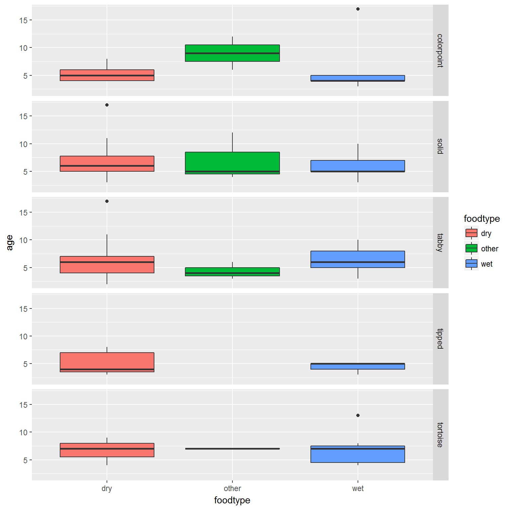
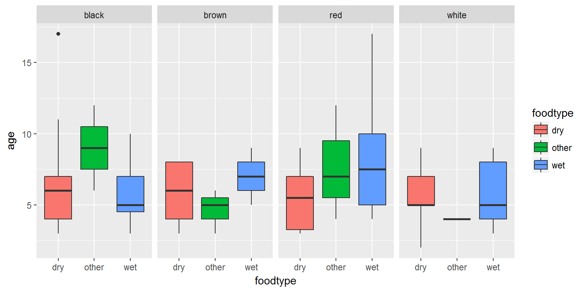
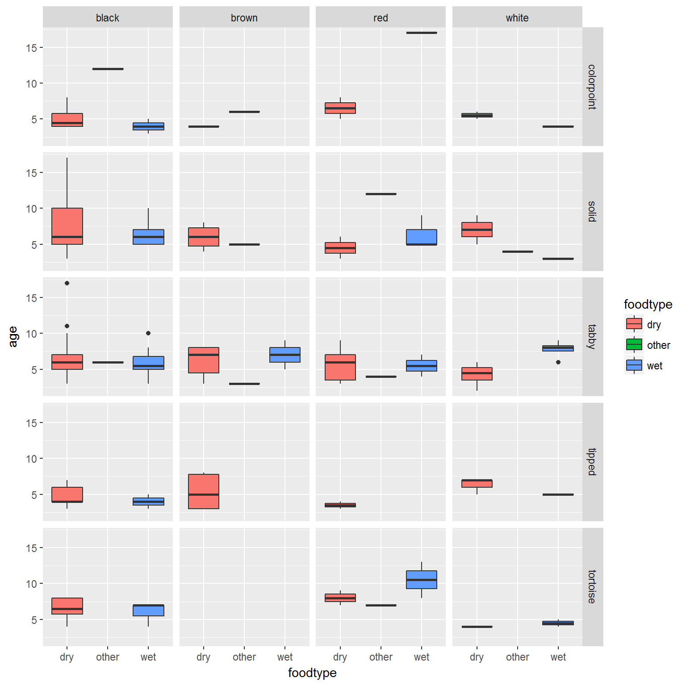
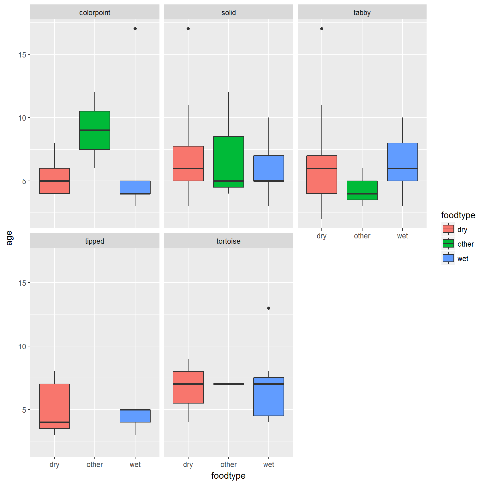

```{r, echo=FALSE, message=FALSE, warning=FALSE}
require(ggplot2)
catdata <- read.csv("../../datasets/catdata.csv", sep=";")
```


# Relier paramètres graphiques et variables: mapping

<div id="left">
Nous avons vu comment définir les paramètres des geoms de manière "absolue". Par exemple:

```{r, fig.width=6, fig.height=4}
p <- ggplot(catdata, aes(x=haircolor, y=weight)) +
  geom_boxplot(fill="lightskyblue")
```

</div>

<div id="right">
Je peux aussi **lier** un paramètre graphique à une variable. On appelle ce procédé **mapping**. 

Cette variable fait alors partie des **aesthetics**.

```{r, fig.width=6, fig.height=4}
p <- ggplot(catdata,aes(x=haircolor,y=weight)) + 
  geom_boxplot(aes(fill=haircolor))
plot(p)
```
</div>

# Relier paramètres graphiques et variables: mapping

<div id="left">
On peut utiliser en aesthetic des variables autres que celles qui définissent x et y... Cela veut dire que l'on peut très simplement **rajouter des couches d'information** (et les **légendes** correspondantes!) au graphique.
</div>

<div id="right">
```{r, fig.width=6, fig.height=4}
p <- ggplot(catdata,aes(x=haircolor,y=weight)) + 
  geom_boxplot(aes(fill=sex))
plot(p)
```
</div>

# # Esthétique propre à geom vs esthétique propre à graphique

Remarquez que l'esthétique `fill=sex` peut être spécifiée à la fois dans l'appel à `geom_boxplot()` et l'appel à `ggplot()` elle-même

<div id="left">

```{r,fig.width=6, fig.height=4}
p <- ggplot(catdata,aes(x=haircolor,y=weight)) + 
  geom_boxplot(aes(fill=sex))
plot(p)
```
</div>

<div id="right">
```{r, fig.width=6, fig.height=4}
p <- ggplot(catdata,aes(x=haircolor,y=weight, fill=sex)) + 
  geom_boxplot()
plot(p)
```
</div>

# Esthétique propre à geom vs esthétique propre à graphique

Cependant l'endroit où l'esthétique est spécifiée peut avoir un effet quand le graphique comprend plusieurs couches:

<div id="left">

```{r, fig.width=6, fig.height=4}
p <- ggplot(catdata,aes(x=haircolor,y=weight)) + 
  geom_boxplot(aes(fill=sex))+
  geom_point(shape=24,size=2)
plot(p)
```
</div>

<div id="right">
```{r, fig.width=6, fig.height=4}
p <- ggplot(catdata,aes(x=haircolor,y=weight, fill=sex)) + 
  geom_boxplot() +
  geom_point(shape=24,size=2)
plot(p)
```
</div>


# Facettes (en lignes)

<div id="left">
```{r, fig.width=8, fig.height=8, fig.show="hide", fig.path="figures/",label="facettes"}
p <- ggplot(catdata, aes(x=foodtype, y=age)) +
  geom_boxplot(aes(fill=foodtype))  
pf=p+facet_grid(hairpattern~.)
plot(pf)
```
</div>

<div id="right">

</div>


# Facettes (en colonnes) 

<div id="left">
```{r, fig.width=8, fig.height=4, fig.show="hide", fig.path="figures/",label="facettes2"}
p <- ggplot(catdata, aes(x=foodtype, y=age)) +
  geom_boxplot(aes(fill=foodtype))  
pf=p+facet_grid(.~haircolor)
plot(pf)
```
</div>

<div id="right">

</div>

# Facettes (en grille)

<div id="left">
```{r, fig.width=8, fig.height=8, fig.show="hide", fig.path="figures/",label="facettes3"}
p <- ggplot(catdata, aes(x=foodtype, y=age)) +
  geom_boxplot(aes(fill=foodtype))  
pf=p+facet_grid(hairpattern~haircolor)
plot(pf)
```

</div>

<div id="right">

</div>

# Facettes (libres)

<div id="left">
```{r, fig.width=8, fig.height=8, fig.show="hide", fig.path="figures/",label="facettes4"}
p <- ggplot(catdata, aes(x=foodtype, y=age)) +
  geom_boxplot(aes(fill=foodtype))  
pf=p+facet_wrap(~hairpattern)
plot(pf)
```
</div>

<div id="right">

</div>

