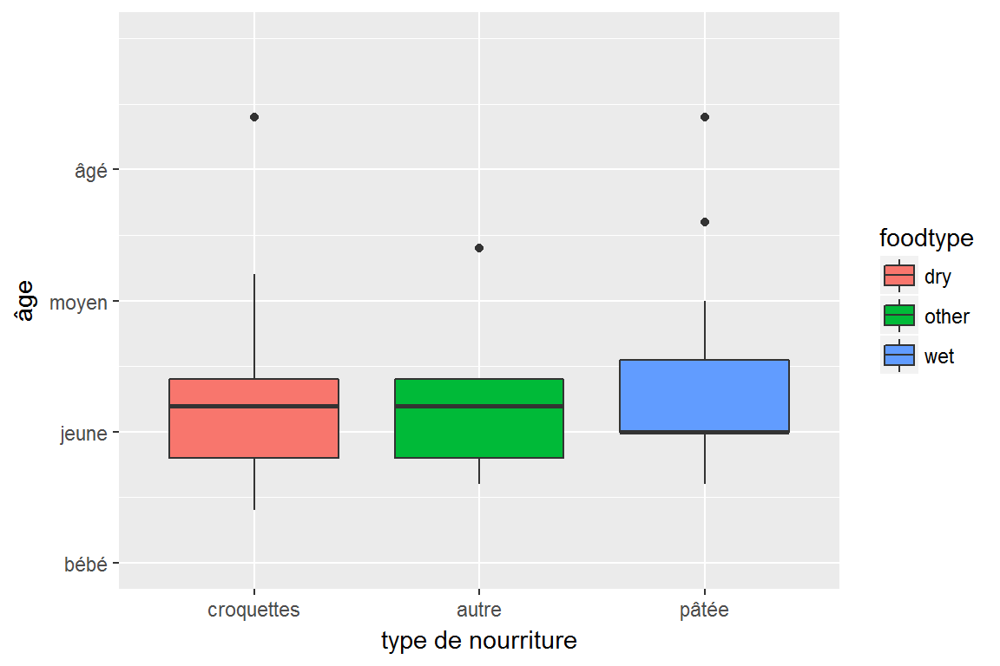

  
```{r, echo=FALSE, message=FALSE, warning=FALSE}
require(ggplot2)
catdata <- read.csv("../../datasets/catdata.csv", sep=";")
```

# Titres des axes

<div id="left">
`ggplot2` offre également des outils pour travailler facilement sur les problèmes de titres, d'échelles et d'axes.

</div>

<div id="right">
```{r, fig.width=6, fig.height=4}
p <- ggplot(catdata, aes(x=foodtype, y=age)) +
  geom_boxplot(aes(fill=foodtype)) + 
  labs(x="type de nourriture",
       y="âge")
plot(p)
```
</div>


# Echelles des axes

Un des aspects les plus intéressants de `ggplot2` est la facilité avec laquelle on peut transformer les variables de position x et y.

<div id="left">
## sans transformation d'échelle
```{r, fig.width=6, fig.height=4}
p <- ggplot(catdata, aes(x=foodtype, y=age)) +
  geom_boxplot(aes(fill=foodtype)) + 
  labs(x="type de nourriture",
       y="âge")
plot(p)
```
</div>

<div id="right">
## avec transformation d'échelle
```{r, fig.width=6, fig.height=4}
p <- ggplot(catdata, aes(x=foodtype, y=age)) +
  geom_boxplot(aes(fill=foodtype)) + 
  labs(x="type de nourriture",
       y="âge") +
  scale_y_log10(breaks=seq(2,17,by=2))
plot(p)
```
</div>

# Limites des axes

On peut également définir des limites d'axes

<div id="left">
## sans limites d'axes
```{r, fig.width=6, fig.height=4}
p <- ggplot(catdata, aes(x=foodtype, y=age)) +
  geom_boxplot(aes(fill=foodtype)) + 
  labs(x="type de nourriture",
       y="âge")
plot(p)
```
</div>

<div id="right">
## avec limites d'axes
On peut également définir des limites d'axes

```{r, fig.width=6, fig.height=4}
p <- ggplot(catdata, aes(x=foodtype, y=age)) +
  geom_boxplot(aes(fill=foodtype)) + 
  labs(x="type de nourriture",
       y="âge") + 
  scale_y_continuous(limits=c(0,20))
plot(p)
```
</div>

# Etiquettes des axes

<div id="left">

Ou définir les endroits où les barres s'affichent sur l'axe (argument **breaks**), ainsi que les étiquettes associées (argument **labels**). 

```{r, fig.width=6, fig.height=4, label="etiquettes_axes", fig.path="figures/", fig.show='hide'}
p <- ggplot(catdata, aes(x=foodtype, y=age)) +
  geom_boxplot(aes(fill=foodtype)) + 
  labs(x="type de nourriture",
       y="âge") +
  scale_y_continuous(limits=c(0,20),
                     breaks=c(0,5,10,15),
                     labels=c("bébé","jeune","moyen","âgé")) +
  scale_x_discrete(labels=c("dry"="croquettes",
                            "wet"="pâtée",
                            "other"="autre"))
plot(p)
```
</div>


<div id="right">

</div>

# Echelles colorées

<div id="left">

```{r}
p <-ggplot(catdata, aes(x=haircolor, y=weight, fill=haircolor))+
  geom_boxplot()+
  scale_fill_manual(values=c("black","brown","orange","white"))
plot(p)
```

</div>
<div id="right">
```{r}
p <-ggplot(catdata, aes(x=age, y=weight, color=haircolor))+
  geom_point(size=2)+
  scale_color_manual(values=c("black","brown","orange","white"))
plot(p)
```
</div>

# Echelles colorées

<div id="left">
```{r}
p <-ggplot(catdata, aes(x=hairpattern))+
  geom_bar(aes(fill=hairpattern))+
  scale_fill_brewer(palette="Purples")
plot(p)
```
</div>
<div id="right">
```{r}
p <-ggplot(catdata, aes(x=age, y=weight))+
  geom_bin2d(binwidth=1)+
  scale_fill_gradient(low="yellow",high="green")
plot(p)
```
</div>


# Thèmes

Les thèmes permettent de définir l'allure globale du graphique. On peut modifier le thème de la manière suivante :

<div id="left">
## classic
```{r, fig.width=6, fig.height=4}
p <- ggplot(catdata, aes(x=age, y=weight, color=haircolor)) +
  geom_point() +
  theme_classic()
plot(p)
```
</div>

<div id="right">
## black & white
```{r, fig.width=6, fig.height=4}
p <- ggplot(catdata, aes(x=age, y=weight, color=haircolor)) +
  geom_point() +
  theme_bw()
plot(p)
```
</div>

# Thèmes

Les thèmes permettent de définir l'allure globale du graphique. On peut modifier le thème de la manière suivante :

<div id="left">
## minimal
```{r, fig.width=6, fig.height=4}
p <- ggplot(catdata, aes(x=age, y=weight, color=haircolor)) +
  geom_point() +
  theme_minimal()
plot(p)
```
</div>

<div id="right">
## grey
```{r, fig.width=6, fig.height=4}
p <- ggplot(catdata, aes(x=age, y=weight, color=haircolor)) +
  geom_point() +
  theme_grey()
plot(p)
```
</div>

