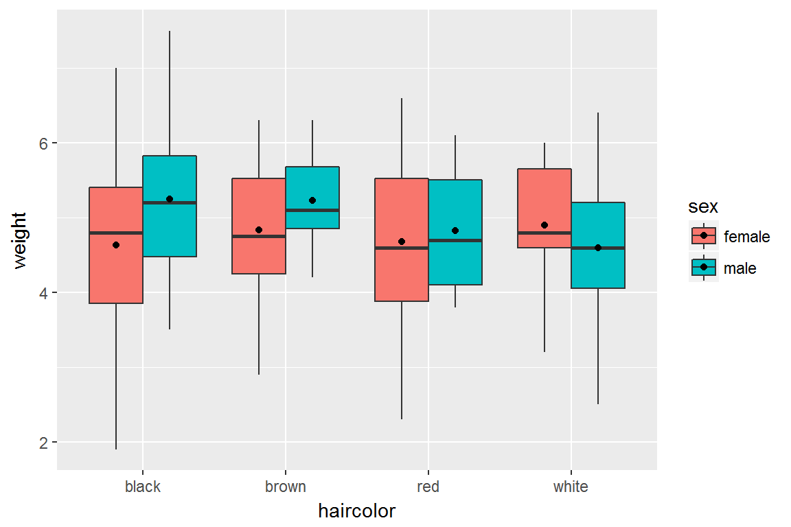

```{r, echo=FALSE, message=FALSE, warning=FALSE}
require(ggplot2)
catdata <- read.csv("../../datasets/catdata.csv", sep=";")
```

# Statistiques descriptives

<div id="left">
Le package `ggplot2` permet en outre de rajouter des couches d'information "statistique" via la fonction `stat_summary`. Par exemple, on peut rajouter un geom de type point qui nous informe sur les moyennes par groupes -définis pour la variable x, c'est à dire haircolor-. 

```{r, fig.width=6, fig.height=4}
p <- ggplot(catdata,aes(x=haircolor,y=weight)) + 
  geom_boxplot(aes(fill=sex)) +
  stat_summary(fun.y=mean, 
               geom="point")
plot(p)
```
</div>

<div id="right">
On peut calculer une statistique sur les autres aesthetics. Ici par exemple on combien les groupes données par la variable haircolor et par la variable sex:

```{r, fig.width=6, fig.height=4}
p <- ggplot(catdata,aes(x=haircolor,y=weight)) + 
  geom_boxplot(aes(fill=sex)) +
  stat_summary(fun.y=mean,
                     geom="point",
                     aes(fill=sex))
plot(p)
```
</div>

# Statistiques descriptives

<div id="left">
```{r, fig.width=6, fig.height=4}
p <- ggplot(catdata,aes(x=haircolor,y=weight)) + 
  geom_boxplot(aes(fill=sex)) +
  stat_summary(fun.y=mean,
               geom="point")
plot(p)
```
</div>

<div id="right">
```{r, fig.width=6, fig.height=4}
p <- ggplot(catdata,aes(x=haircolor,y=weight,fill=sex)) + 
  geom_boxplot() +
  stat_summary(fun.y=mean,
               geom="point")
plot(p)
```
</div>

# Statistiques descriptives
<div id="left">

Pour ajuster la position (en x) des moyennes en fonction de sex on peut procéder comme suit:

```{r, fig.width=6, fig.height=4, fig.path="figures/",label="position", fig.show="hide"}
p <- ggplot(catdata,aes(x=haircolor,y=weight)) + 
  geom_boxplot(aes(fill=sex)) +
  stat_summary(fun.y=mean,
               geom="point",
               aes(fill=sex), 
               position=position_dodge(width=0.75))
plot(p)
```
</div>
<div id="right">


</div>

# Modèle de régression

<div id="left">
Le package `ggplot2` offre aussi des possibilités intéressantes pour travailler sur le lien entre deux variables quantitatives (modèles de régression):

```{r,  fig.width=6, fig.height=4}
p <- ggplot(catdata, aes(x=age,y=weight)) +
  geom_point(aes(col=sex)) +
  geom_smooth()
plot(p)
```
</div>
<div id="right">
On ajoute une droite de régression avec la fonction `geom_smooth` (ici par défaut, régression de type loess). Allez voir le fichier d'aide associé à la fonction `geom_smooth` pour voir l'ensemble des paramètres de cette fonction...


Plus d'explications sur la régression loess [ici](http://perso.ens-lyon.fr/lise.vaudor/regression-loess/)
</div>

# Modèle de régression

On peut préciser le modèle en précisant des aesthetics supplémentaires:

```{r,  fig.width=6, fig.height=4}
p <- ggplot(catdata, aes(x=age,y=weight,col=sex)) +
  geom_point() +
  geom_smooth()
plot(p)
```

# Modèle de régression linéaire

<div id="left">
Le type de régression réalisé est également paramétrable. Ici, par exemple, on réalise une régression linéaire:

```{r,  fig.width=6, fig.height=4}
p <- ggplot(catdata, aes(x=age,y=weight)) +
  geom_point(aes(col=sex))+
  geom_smooth(mapping=aes(col=sex),
              method="lm")
plot(p)
```
</div>

<div id="right">
`ggplot2` permet de produire la **représentation graphique** du modèle de régression. Pour effectuer une régression et (par exemple récupérer ses coefficients), on passe par `lm()`:

```{r}
reg=lm(weight~age*sex, data=catdata)
summary(reg)
```


</div>